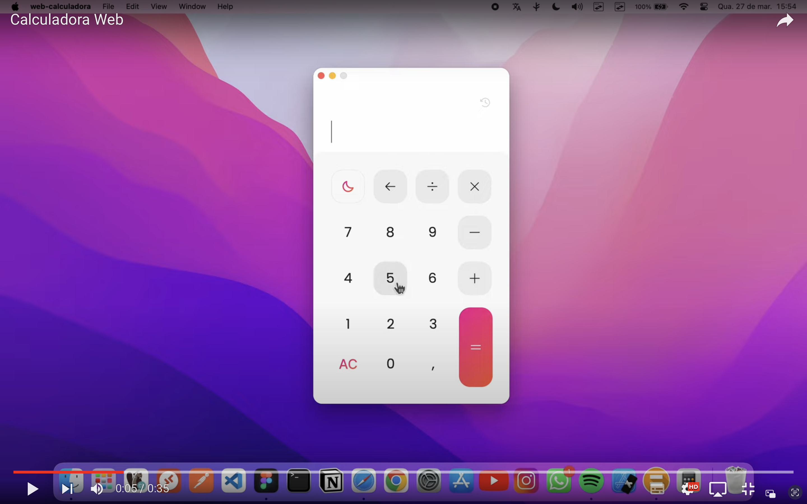
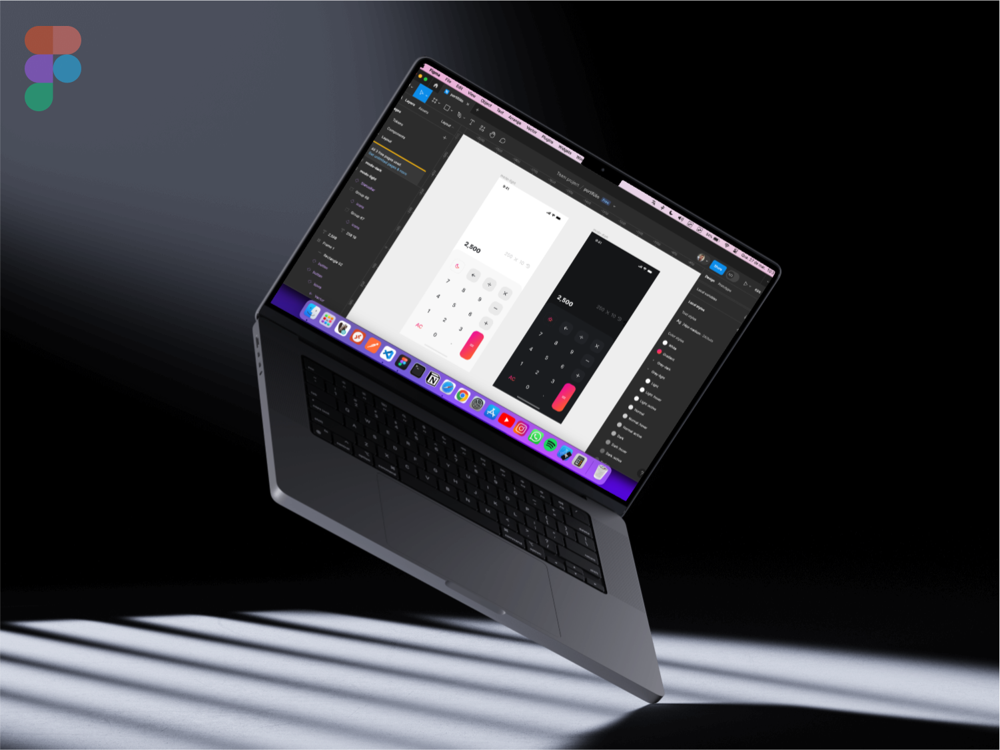

<h1 align="center">
  <br>

  <br>
Calculadora
  <br>
</h1>

<h4 align="center">Um aplicativo de calculadora básica utilizando <a href="https://pt-br.react.dev/blog/2023/03/16/introducing-react-dev" target="_blank">React JS</a> e <a href="https://www.electronjs.org" target="_blank">Electron JS</a>.</h4>


<p>Clique no player para visualizar em alta qualidade no YouTube 🖥️.</p>

| GIF   | YouTube | 
:--------:| :---------:|
|  | [](https://youtu.be/M7MRxgdw8cY "Assistir ao video") |


## Protótipo figma

<p>Clique na imagem para visualizar no figma.</p>

  [](https://www.figma.com/file/pf0dNRmKaBnkNQoKFbZpkz/portif%C3%B3lio?type=design&node-id=0%3A1&mode=design&t=GS4wXvXttCvAZyaj-1 "Visualizar no figma")


## Características principais

* **Layout Limpo** - Uma interface organizada e intuitiva que permite aos usuários identificar facilmente os botões de números, operadores e outras funções.

* **Botões Númericos e de Operação** - Botões claros e bem distribuídos para números (0-9) e operadores básicos (adição, subtração, multiplicação, divisão).

* **Botão de Igualdade** - Um botão de "igual" para realizar o cálculo quando os números e operadores forem inseridos.

* **Botão de Limpeza** - Um botão distintamente visível e de fácil acesso para limpar a tela da calculadora e iniciar uma nova operação, além de outro botão para apagar gradualmente a entrada do usuário, permitindo corrigir erros de digitação de forma conveniente e precisa.

* **Exibição de histórico** - Uma área de exibição ampla e destacada, que apresenta claramente a última operação realizada. Além disso, permite aos usuários clicar sobre ela para recuperar a operação anterior, facilitando a revisão e a correção de cálculos.

* **Funcionalidade Adicional** - Botão de alternância entre temas escuro e claro, permitindo aos usuários personalizar a aparência da calculadora de acordo com suas preferências de visualização, seja em ambientes com pouca luz ou luminosos.

## Como usar

Para clonar e executar este aplicativo, você precisará do [Git](https://git-scm.com) e do [Node.js](https://nodejs.org/en/download/) (que vem com o [npm](http://npmjs.com)) instalados em seu computador. 
<br>
Na sua linha de comando:

```bash
# Clone o repositorio
$ git clone https://github.com/kaique-oliveira/web-calculadora.git

# Entre no repositório
$ cd web-calculadora

# Instalar dependências
$ npm install

# Execute o aplicativo
$ npm run start 

# Para gerar o instalavel do Windows
$ npm run build-win

# Para gerar o instalavel do Mac OS
$ npm run build-mac
```

## Credits

Principais frameworks e bibliotecas utilizados:

- [React-JS](https://pt-br.react.dev/blog/2023/03/16/introducing-react-dev)
- [Electron-JS](https://www.electronjs.org)
- [TypeScript](https://www.typescriptlang.org)
- [Styled-Components](https://styled-components.com)
- [Phosphor-React-Native](https://github.com/duongdev/phosphor-react-native)
- [Vite](https://vitejs-dev.translate.goog/?_x_tr_sl=en&_x_tr_tl=pt&_x_tr_hl=pt-BR&_x_tr_pto=sc)


---

> GitHub [@kaique-oliveira](https://github.com/kaique-oliveira) &nbsp;&middot;&nbsp;
> Linkedin [@kaique-oliveira](https://www.linkedin.com/in/kaique-oliveira-a21273162/)

